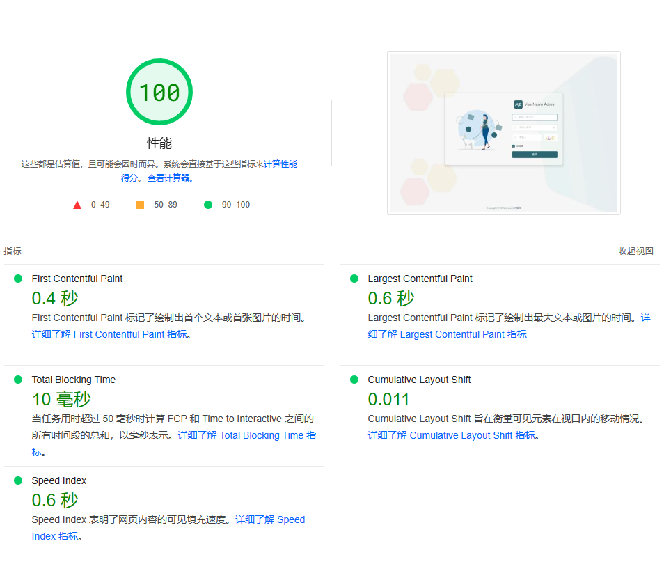
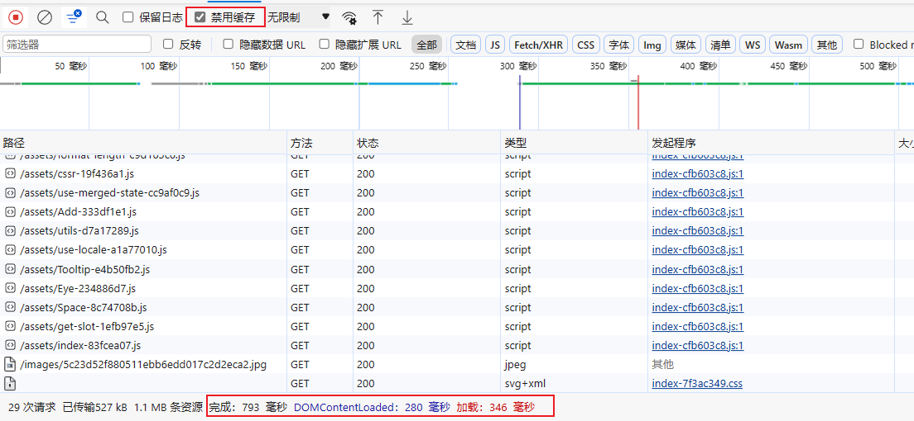
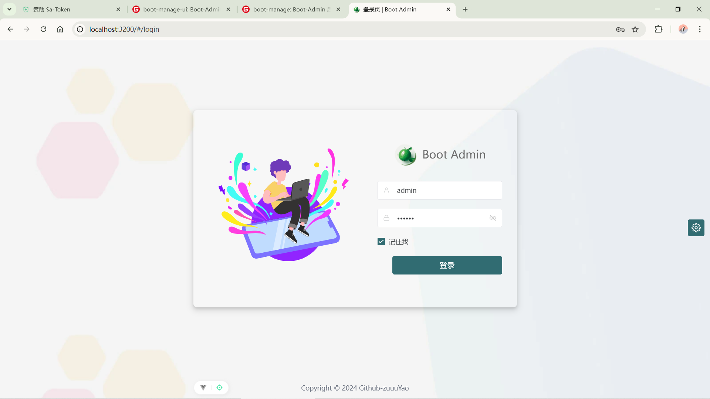
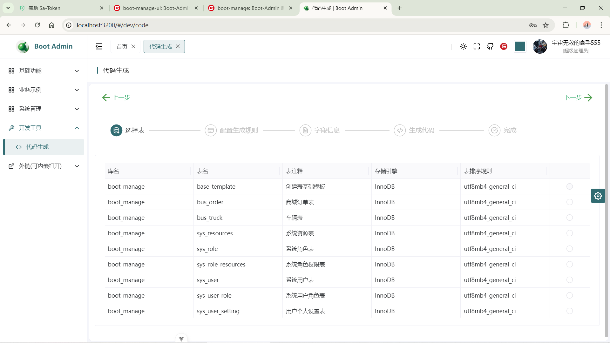
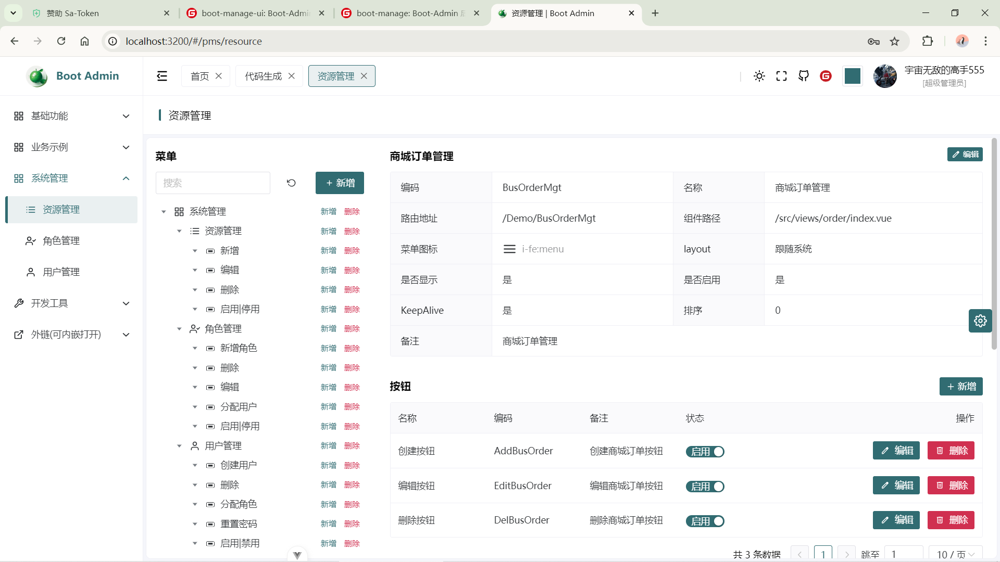

<p align="center">
  <a href="https://github.com/HuangZhongYao/boot-manage-ui">
    
  </a>
</p>
<p align="center">
  <a href="./LICENSE"></a>
</p>

## 简介

Boot Admin是一款极简风格的后台管理模板。
前端基于`zclzone`的[Vue Naive Admin](https://github.com/zclzone/vue-naive-admin/)进行二次开发，使用 Vite + Vue3 + Naive UI + Pinia + Unocss + 无 Typescript降低门槛。
后端使用 SpringBoot 3.x + MyBatis-Plus + Sa-Token + Redis + Java 17 + MySql 8.0 。
使用最新技术简单易用、代码优雅、赏心悦目。封装接口开发中常用参数验证、mybatis-plus扩展、统一响应值包装、代码生成，一键生成CRUD开发效率极高！！

## 设计理念

秉持着`简单即正义`的理念，旨在帮助中小企业、在校大学生及个人开发者快速上手开发后台管理项目，为了降低使用者的学习成本，
没有使用看似主流的 TypeScript（前端），使得成为了市面上少有的 `使用 JavaScript 的 Vue3 后台管理模板`，
而且还算优秀，得到了大量朋友的认可和喜爱。

## 在线体验

访问地址: http://boot-admin.zuuuyao.asia
账号：admin
密码：123456

## 特性

- 🆒 使用 **Vue3** 主流最新技术栈: `Vite + Vue3 + Pinia`
- 🍇 使用 **原子CSS**框架: `Unocss`，优雅、轻量、易用
- 🍍 集成 `Pinia` 状态管理，支持状态持久化
- 🤹 使用主流的 `iconify + xicons + unocss` 图标方案，支持自定义图标，支持动态渲染
- 🎨 使用 Naive UI，`极致简洁的代码风格和清爽的页面设计`，审美在线，主题轻松定制
- 👏 先进且易于理解的文件结构设计，多个模块之间**零耦合**，单个业务模块删除不影响其他模块
- 🚀 `扁平化路由`设计，每一个组件都可以是一个页面，告别多级路由 `KeepAlive` 难实现问题
- 🍒 `基于权限动态生成路由`，无需额外定义路由，`403和404页面可区分`，而不是无权限也跳404
- 🔐 基于Redis集成 `无感刷新`，用户登录态可控，安全与体验缺一不可
- ✨ 基于 Naive UI 封装 `message` 全局工具方法，支持批量提醒，支持跨页面单例模式
- ⚡️ 基于 Naive UI 封装常用的业务组件，包含`Page` 组件、`CRUD` 表格组件及 `Modal`组件等，简单易用，减少大量重复性工作
- 💻 代码生成 一键生成后端Entity、VO、DTO、Service、Repository、Mapper.xml、Controller、前端页面，减少大量重复性工作

## 极致的性能




## 前端页面预览

- 登录页面 
- 代码生成页面 
- 系统管理页面 

## 安装

```shell
# 拉取最新模板
git clone https://github.com/HuangZhongYao/boot-manage-ui.git
# 安装依赖
npm install
# 本地启动 启动后端服务后访问http://localhost:3200 登录账号admin 密码 123456
npm run dev
# 打包
npm run build
# 预览构建后的项目
npm run preview
```

## 后端

Boot Admin 提供一套Java最新技术开发的后端代码，简易上手、效率高SpringBoot单体架构版，提供RABC、代码生成、系统基础等接口所需的一些基础接口 。

技术栈:

- Java 17
- SpringBoot 3.2.x
- Mybatis-Plus
- Sa-Token
- JWT
- Redis
- MySQL 8

源码

- 源码-github: [boot-manage | github](https://github.com/HuangZhongYao/boot-manage)
- 源码-gitee: [boot-manage | gitee](https://gitee.com/smog_huang/boot-manage)

## 文档

- 项目文档:
- 接口文档: [在线Apifox接口文档](https://apifox.com/apidoc/shared-328df828-c5b1-44b0-abfb-357ef8276d29)

## 版权说明

本项目使用 `MIT协议`，默认授权给任何人，被授权人可免费地无限制的使用、复制、修改、合并、发布、发行、再许可、售卖本软件拷贝、并有权向被供应人授予同等的权利，但必须满足以下条件:

- 复制、修改和发行本项目代码需包含原作者的版权及许可信息，包括但不限于文件头注释、协议等

作者只想保留版权，没有任何其他限制。
